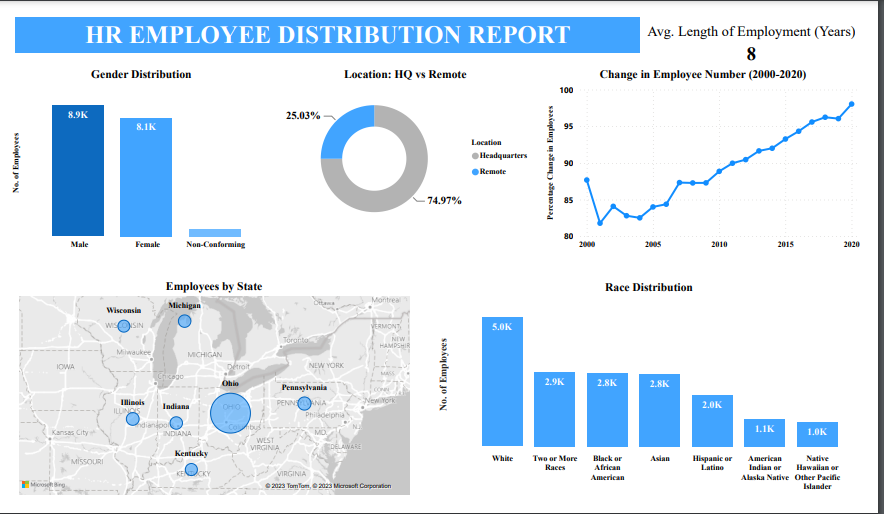

# A Human Resource Analysis and Visualization Using MySQL and PowerBI

## Data Used
The `Human Resources.csv` file contains 22214 records.  
The data runs between the years 2000 to 2020.
## Exploratory Data Analysis
The project utilised MySQL and Excel to explore and clean the data.  
- The process involved changing column names and data types.
- The process also revealed some outliers. These were ignored during the querying process.
- Null values were filled in accordingly.
- This left 17,482 records to be worked on.
Data visualisation was performed using Microsoft PowerBI.
## Business Questions
Below are the questions the analysis sought to answer:
  1. What is the gender breakdown of employees in the company?
  2. What is the race/ethnicity breakdown of employees in the company?
  3. What is the age distribution of employees in the company?
  4. How many employees work at headquarters versus remote locations?
  5. What is the average length of employment for employees who have been terminated?
  6. How does the gender distribution vary across departments and job titles?
  7. What is the distribution of job titles across the company?
  8. Which department has the highest turnover rate?
  9. What is the distribution of employees across locations by city and state?
  10. How has the company's employee count changed over time based on hire and term dates?
  11. What is the tenure disrbution for each department? (time employees spend in a department)
## Findings
### 1. Gender Distribution
There were more male employees than female employees in the company during the period under review.
### 2. Race/Ethnicity
- Most employees were White.
- Employees who were of two or more ethnical descent, either Black or African American and Asian closely followed in number.
- Native Hawaiian or Other Pacific Islanders were the least in number.
### 3. Age Distribution
- Employee ages varied from 20 to 57 years.
- The age groups 18 to 24 and 55 to 64 had the least employee composition.
- Highest number of employees fell in the 25 to 44 age group.
- Most male employees fell in the 35 to 44 age group while most females were in the 25 to 34 age group.
### 4. HQ vs Remote Workers
- 74.97% of employees work at the headquarters while 25.03% work from remote locations.
### 5. Average Length of Employment for Terminated Employees
- Employees in this company will stay for an average of 8 years before exiting.
### 6. Gender Distribution - Departments and Job Titles
- The Engineering Department had the highest number of employers for all genders.
- This was followed by Accounting, Human Resources and Sales departments.
- The least employee count was in the Marketing, Legal and Auditing departments.
### 7. Job Titles in the Company
- The records showed 182 distinct job titles spread across the various departments.
- Departments were 13 in number.
### 8. Turnover Rate by Department
- The Auditing Department saw the highest length of employment among employees who had exited the company.
- Services, Sales and Marketing had the lowest tenure among the departments in this company.
### 9. Employee Locations
- The State of Ohio seems like the most preferred location for employees.
- This is the company's headquarters based on the data pattern.
### 10. Change in Employee Count Over the Period
- Employee retention rate continued to increase over the years.
- There were more hires than exits with the net change decreasing gradually from 2009 (87.29%) to 2020 (98.04%).
### 11. Tenure Distribution by Department
- Average tenure is 8 years.
- Product Management Department has the least average tenure of 6 years.
## Project Limitations
- Some 967 records had negative ages. They were treated as outliers and excluded from the analysis.
- The `termdates` column had some extravagant dates that were in the future. This analysis was limited to only those on or before the current date.
## Recommendations
- Update the database to reflect a more up-to-date perspective.
- Compare similar companies' data to gauge performance in terms of human capital and HR related activities.

